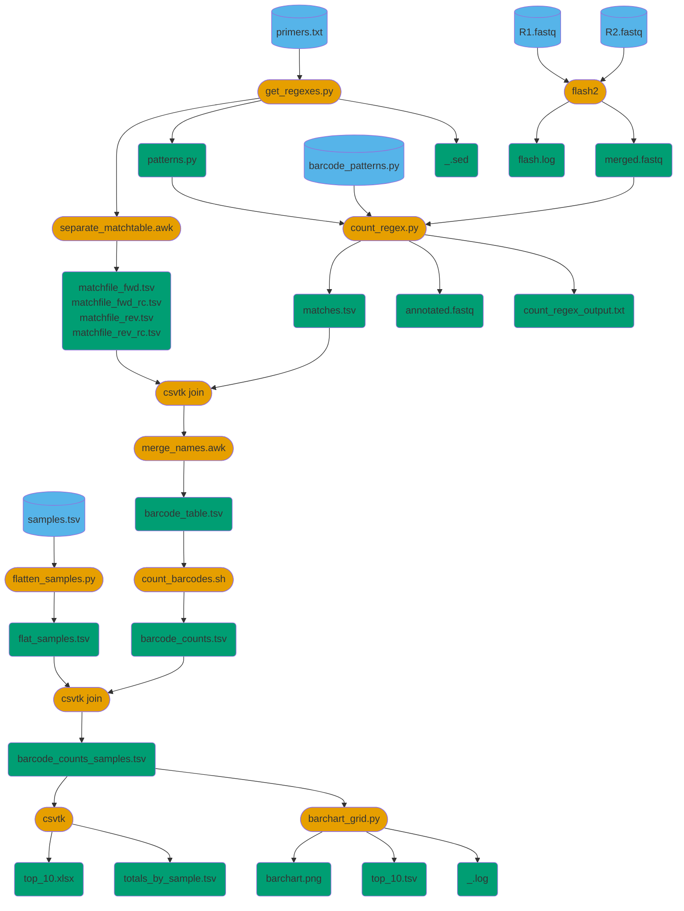

# Files for analysis of amplicons

## Requirements
- [Docker](https://www.docker.com/products/docker-desktop/)

## Usage
Build the Docker image, if not already built:
```bash
docker build -t nijhawanlab/amplicons .
```

or pull the image:
```bash
docker pull nijhawanlab/amplicons
```

Then, from the data directory containing the FASTQ files, start a
Docker container using the `start.sh` script, or like this:
```bash
docker run -it \
       --mount type=bind,source="$(pwd)",target=/home/bio/data \
       nijhawanlab/amplicons
```
You will be logged into the container as user `bio`, in the home
directory `/home/bio`.  There are three subdirectories:
```
/home/bio
├── amplicons
├── data
└── extsource
```
`amplicons` contains this repository, the source for the analysis.
`data` is bound to the directory from which you started the container.

Optionally, you can bind `extsource` to a local directory on the host
machine.  This is useful for debugging the analysis code, since you do
not need to rebuild the Docker image when you make changes:
```bash
docker run -it \
       --mount type=bind,source="$(pwd)",target=/home/bio/data \
       --mount type=bind,source=/my/local/source/directory,target=/home/bio/extsource \
       nijhawanlab/amplicons
```
The `start.sh` script gets the name of the local source directory from
the environment variable `$SOURCE_DIR`, or defaults to `$HOME/bio/amplicons`.

Once you are at the command prompt of the running Docker container,
you can run your analysis using the `make` workflow:
```bash
cp ./amplicons/Makefile ./data
cd data/
make settings
make all
```
If you prefer to use the host machine's local copy of the source
(`extsource`), then
```bash
export EXT_SOURCE=true
```
before running the make.

## Makefile Data Flow

